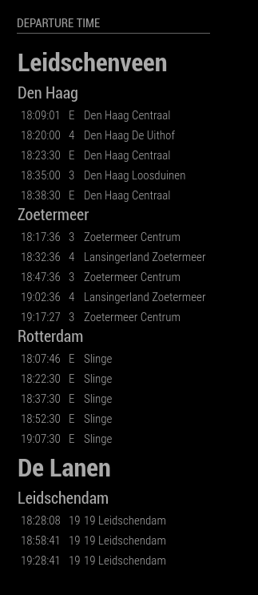
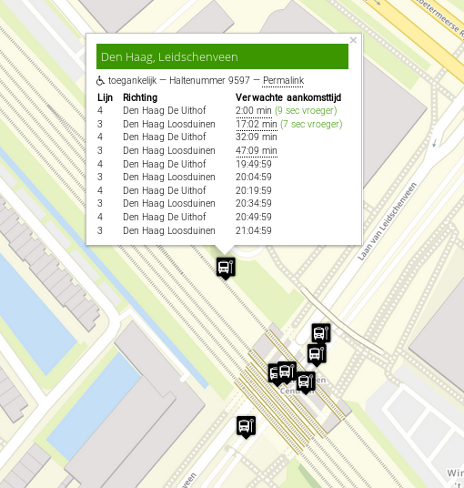

# MMM-NLDepartureTimes

## Introduction
This module shows the departure times of public transport grouped by stops and sorted on destination of choiche. In this example you see the stop Leidschenveen that is LightRail hub. Besides linee 3,4, and E, also lines 19, 30, and N5 are servicing this stop but are not visible in the time table. The lines are grouped to their destination, not their line number.



Destination is also set to what make sense for use. For instance Line 3 goes to Den Haag Loosduinen and E goes the Den Haag Centraal. For me it is relevant they go to Den Haag where I know where to leave the train or the streetcar.

The data is retrieved from [OVapi](www.ovapi.nl). OVApi is a semi private project that allows usage from others. Please keep refresh rate low, because the want to keep a low traffic rate. For reliable data please see [NDOV Loket](https://www.ndovloket.nl) for reliabale and/ar commercial solution.

**Note:** This Module only works with Dutch Public transportation.

## Installation
Clone the repository with

    git clone git@github.com:Travelbacon/MMM-NLDepartureTimes.git ./

This module depends on [Axios](https://github.com/axios/axios). Install it to go to the module folder and execute:

    npm install

## Configuration
To use this module, add the follwing configuration to your `config/config.js` file. This is an example for a lightrail station in The Hague. This example will be used throughout this readme.md.
```javascript
  modules: [
  {
    module: "MMM-NLDepartureTimes",
    position: "top_left",
    header: "Departure Times",
    config: {
      maxVehics: 5,
      updateSpeed: 10,
      locale: 'nl-NL',
      tpc: {
        'Leidschenveen':{
          'Den Haag': [31008721, 32009597],
          'Zoetermeer': [32009596],
          'Rotterdam': [31008722]
        },
        'De Lanen':{
          'Leidschendam': [32009591]
        }
      }
    }
	}]
```

| Option | Description
|----------|-------------
|`module`   | Module Name. (See [MM Documentation](https://docs.magicmirror.builders/modules/configuration.html))
|`position` | Postion of the module. (See [MM Documentation](https://docs.magicmirror.builders/modules/configuration.html))
|`header`   | Title displayed in. (See [MM Documentation](https://docs.magicmirror.builders/modules/configuration.html))
|`maxVehics` | Number of departure times displayed per destinaton.<br>**Type:** Integer
|`updateSpeed` | refresh time in minutes. Please keep a slow refresh due non commercial property of the API server. See [Github](https://github.com/skywave/KV78Turbo-OVAPI/wiki) of OVapi for etiquette.<br>**Type:** Integer
|`tpc` | See configure stops below.<br>**Type:** Javascript Object.

## Configure stops
### The TPC Object in config.
The tpc parameter in the settings is a Javascript Object. TPC is a code that is used to identify a stop. To get the right TPC, it will require some research. Until now I haven't found one document that contains all the data needed. Mainly the reason is that data is supplied raw by Bison and NDOV Loket. But you can find some documents shattered over the internet. If you find a quicker soluiton, please let me know!

#### Objet design:

| Level | Description | Explanation
|-------|-------|------
|Top  | Name of the group of stops.| It is the name you want to give to group of stops.
|2nd  | Name of the destination | Array that contains the actual TPC (stopcodes) **Type:** Integer

#### Find the TPC code
**tldr;**
The TPC is in the xml file called PassengerStopAssignmentCHB{timestamp}.xml from [NDOV Loket's haltes folder](https://ndovloket.nl/opendata/haltes).
Convert stopname to stopcode at [OV Zoeker](https://ovzoeker.nl/l) or [KV1](http://data.ndovloket.nl/) Convert stopcode to TPC via the XMLs from [halte export](http://data.ndovloket.nl/haltes).

First you need to find a location where you want to get the departure times from. In this example I picked two stops I want to get data from. The stops of RandstadRail 3 & 4 to The Hague and to Zoetermeer. Even though Line 3,4 have a different and stop, they will all stop in The Hague and Zoetermeer. Metro line E to The Hague and Rotterdam. The buslines , tram line 19, and night bus are not needed. I will call this stop Leidschenveen. The real names are Leidschenveen Centrum, Tram/Metro Station Leidchenveen, and Leidschenveen. Even though it is one location, it has 3 different names. 
From a tram stop further line 19 only to Leidschendam is needed. The other direction to Delft is not needed. I will call this stop 'De Lanen'.

You can find your own stops at [OV Zoeker](https://ovzoeker.nl/) and also the operator. But I think that you already know which stops and lines your interested in.

To sum it up the data I need.

| Stopname | Line | Operator | Destination | Real Destination
|---------------|---|-----|-----------|-------
| Leidschenveen | 3 | HTM | Den Haag | Den Haag Loosduinen
| Leidschenveen | 4 | HTM | Den Haag | Den Haag Uithof
| Leidschenveen | 3 | HTM | Zoetermeer | Zoetermer Centrum West
| Leidschenveen | 4 | HTM | Zoetermeer | Lansingerland Zoetermeer
| Leidschenveen | E | RET | Den Haag | Den Haag Centraal
| Leidschenveen | E | RET | Rotterdam | Slinge
| De Lanen | 19 | HTM | Leidschendam | Leidschendam

Now we now the stopnames we need to get the stopcodes. From [OV Zoeker] (https://ovzoeker.nl/l) you can find them by clicking on a stop and select the code behind 'Haltenummer'.



A more complex way is via [KV1](http://data.ndovloket.nl/) by selecting the KV1 zipped file in the folder of the operator. In this KV1 archive you need the file USERSTOPXXX.TMI. This is plain text file you can open. For line 3 and 4 the userstop code is

`[RecordType]|[Version number]|[Implicit/Explicit]|[DataOwnerCode]|[UserStopCode]|[TimingPointCode]|[GetIn]|[GetOut]|[Deprecated]|[Name]|[Town]|[UserStopAreaCode]|[StopSideCode]|[RoadSideEqDataOwnerCode]|[RoadSideEqUnitNumber]|[MinimalStopTime]|[StopSideLength]|[Description]|[UserStopType]`

`PASSENGER
USRSTOP|1|I|HTM|9597||TRUE|TRUE|N|Leidschenveen Centrum|Den Haag|9589|-|||0||exitDirection=Right;EnableTailTrack=F;SizeOfBay=43;BayBeforePole=38;garage=F|`

From [halte export](http://data.ndovloket.nl/haltes) we can retrieve the PassengerStopAssignmentCHB{timestamp}.xml file and ExportCHB for the trains of NS. Open the XML file and search for the stopcode. In my example I look for `9597` and get the following node back.
```XML
  <quay>
    <quaycode>NL:Q:32009597</quaycode>
    <userstopcodes>
      <userstopcodedata>
        <dataownercode>HTM</dataownercode>
        <userstopcode>9597</userstopcode>
        <validfrom>2014-12-14 00:00:00</validfrom>
      </userstopcodedata>
    </userstopcodes>
  </quay>
```
The ```XML <quaycode>``` contains the TPC code. In this case 32009597.

Now we can test it to be 100% by going to [v0.ovapi.nl/tpc/32009597](v0.ovapi.nl/tpc/32009597). When an XML file is generated with stop data and time information, we have the right TPC code.

The final table will be:

| Stopname | Line | Operator | Destination | stopcode | TPC
|---------------|---|-----|-----------|-------|----
| Leidschenveen | 3 | HTM | Den Haag   | 9597 | 32009597
| Leidschenveen | 4 | HTM | Den Haag   | 9597 | 32009597
| Leidschenveen | 3 | HTM | Zoetermeer | 9596 | 32009596
| Leidschenveen | 4 | HTM | Zoetermeer | 9596 | 32009596
| Leidschenveen | E | RET | Den Haag   | HA8721 | 31008722
| Leidschenveen | E | RET | Rotterdam  | HA8722 | 31008721
| De Lanen | 19 | HTM | Leidschendam   | 9591 | 32009591

Compresses to

| Stopname | Destination | TPC
|--|--|--
| Leidschenveen | Den Haag | 3200597, 31008722
| Leidschenveen | Zoetermeer| 3200596
| Leidschenveen | Rotterdam | 31008721  
| De Lanen | Leidschendam | 32008581

## Licenses
Data from [OVApi](http://www.ovapi.nl) comes from [NDOV Loket](https://ndovloket.nl). The usage is limited to 1 producion system and 1 user. So does the use of this module.
Because data is not from my sources, nor from OVApi, I and OVApi are not responsible for data loss, damage or (in)consistency of data.
For more details please see their websites.
## Privacy Satement
On [OVApi](http://www.ovapi.nl/privacy.html) there is a privacy statement in Dutch. If you require a non-Dutch version, please contact them directly.
I have no responsibly of what happens to your data. Nor do I store any data from you.